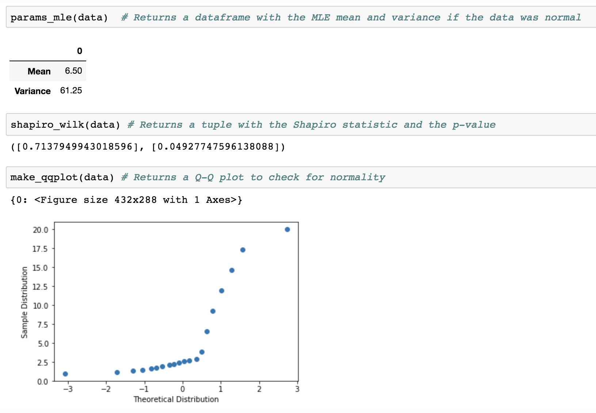
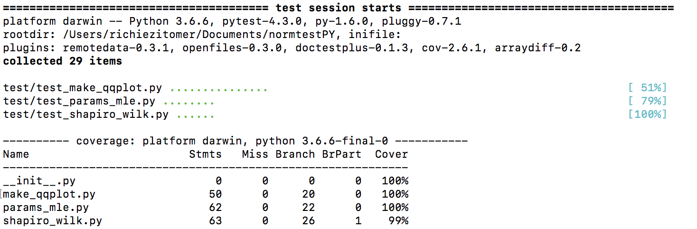

# normtestPY

Contributors: Constantin Shuster, Sylvia Lee, Richie Zitomer

This is a Python package that tests your data for normality!

### Overview    
A common and important assumption that made by many parametric statistical methods (t-tests, ANOVA and linear regression) is that the dependent variable (response variable) is normally distributed across all categories of the independent variables (predictors). Thus testing for normality in the data is an important step before applying parametric statistical methods.

Analysts use graphical and statistical methods to test whether sample data came from a normal population. In normality testing it is important to remember that our null hypothesis is that the sample data is **NOT different** than a normal population with the same mean and variance. If we **fail to reject** this null hypothesis - meaning resultant p-value is > 0.05 - then we would be able to apply the proper parametric statistical methods to our data. Normality testing can also be used to check whether any sample data approximates a normally distributed population. You can find more on this topic [here](https://www.ncbi.nlm.nih.gov/pmc/articles/PMC3693611/) and [here](http://webspace.ship.edu/pgmarr/Geo441/Lectures/Lec%205%20-%20Normality%20Testing.pdf).

### Usage

This package will test your data for normality using a graphical and a statistical method. As a graphical method, this package lets you see a quantile-quantile plots (Q-Q plot) in order for you to visualize whether the data closely approximates a straight line - thereby indicating it is normally distributed. As a statistical method, this package lets you calculate the Shapiro-Wilk test score along with the corresponding p-value. The Shapiro-Wilk test provides better power than most other statistical normality tests, as long as **most of the values are unique** [<sup>1</sup>](https://www.graphpad.com/guides/prism/7/statistics/index.htm?stat_choosing_a_normality_test.htm). This package will also derive the parameters that would fit your data to a normal distribution using maximum likelihood estimation.


#### Example
```{python}
from normtestPY.params_mle import params_mle
from normtestPY.shapiro_wilk import shapiro_wilk
from normtestPY.make_qqplot import make_qqplot

data = [1,2,3,20] # Very simple example of a very non-normal dataset
```



### Installation Instructions
In order to install the package, run the following command from terminal:
```{bash}
pip install git+https://github.com/UBC-MDS/normtestPY
```
Then import the functions that you need.

The package has the following dependencies:
- numpy
- pandas
- matplotlib
- scipy
- math

### Package functions:  
1. `make_qqplot()`
    - **description:** this function will read in data and will create a QQ-plot for each continuous variable in the data. It will output a dictionary of plot objects and print them to screen as default (the user can also opt not to print the plots).
    - **input:** dataframe, series, list, or array
    - **output:** dictionary of plots, where the keys are the column name (or column index in the case of an array-like object)
2. `shapiro_wilk()`
    - **description:** this function will read in data and will output the shapiro-wilks test of normality for each continuous variable in the data. The output will be  tuple of lists where the first list has the test statistics in the order of the variables in the input dataframe and the second list has the p-values in the same respective ordering.   
    - **input:** dataframe, series, list, or array
    - **output:** tuple of lists
        - first list: test statistic
        - second list: p-value
3. `params_mle()`
    - **description:** this function will read in data and will output the mean and variance for the empirical distribution of the data given that the data is normal for each continuous variable in the data. The output will be a dataframe with one row for the mean and one row for the variance. The columns will be the original variables in the data.
    - **input:** dataframe, series, list, or array
    - **output:** dataframe
        - columns: variables
        - rows: mean, variance

### Branch Coverage
We have tests to ensure that are package is working as expected and will continue to do so into the future. As you can see, we have close to full branch coverage:



### Where does this fit into the Python ecosystem

The `SciPy.stats` package has a Shapiro-Wilk test function named [`shapiro()`](https://docs.scipy.org/doc/scipy-0.19.1/reference/generated/scipy.stats.shapiro.html), it takes in an array of sample data and returns the test statistic as a float and the p-value as a float and returns both as a tuple. For Q-Q plots in python, there is a package named `statsmodels` and within it - [`statsmodels.graphics.gofplots.qqplot()`](https://www.statsmodels.org/dev/generated/statsmodels.graphics.gofplots.qqplot.html) - there is a function that takes in 1D array data and creates a `matplotlib` figure. It seems that there is no official PIP or Conda package that provides MLE estimation as a standalone method. In the present, MLE operation requires users to write a self-defined function with the help of [`optimize.minimize()`](https://docs.scipy.org/doc/scipy/reference/generated/scipy.optimize.minimize.html) from `SciPy`.

Two functions from this `normtestPY` package could be found in other python packages, while the `params_mle()` function does not seem to have an official substitute. 'normtestPY' may fit into the Python ecosystem by providing convenience to statisticians whom often need to deal with normality assumptions and estimations. This package is designed to eliminate the hassle to import functions from different packages in which the users may or may not have.

References:

1. [Real Statistics - Shapiro-Wilk Expanded Test](http://www.real-statistics.com/tests-normality-and-symmetry/statistical-tests-normality-symmetry/shapiro-wilk-expanded-test/)
2. [Engineering Statistics Handbook - Anderson Darling and Shaprio-Wilk tests](https://www.itl.nist.gov/div898/handbook/prc/section2/prc213.htm)
